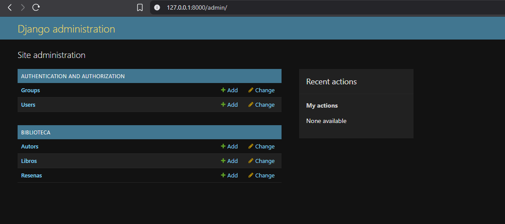
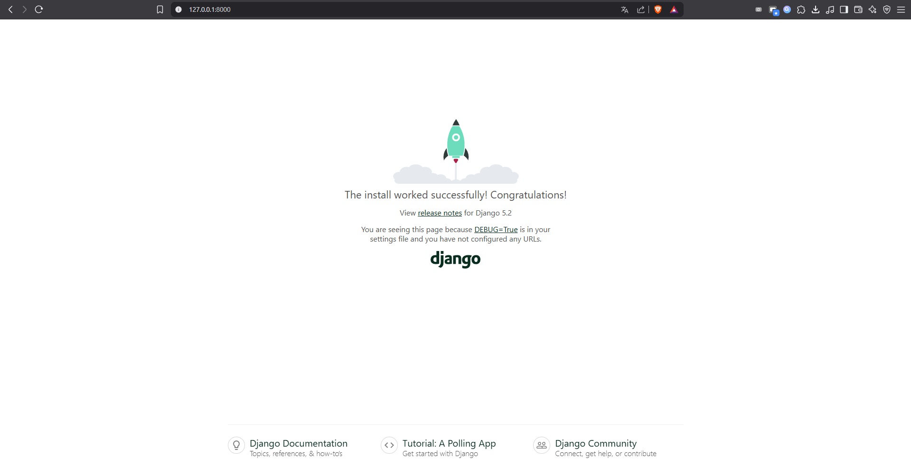
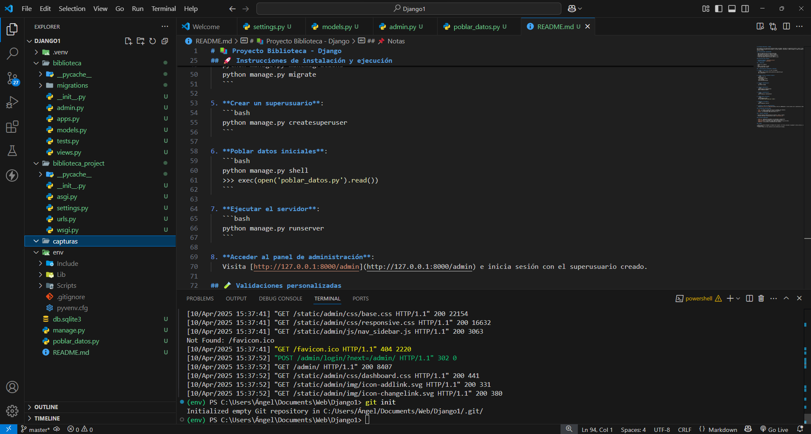

# 📚 Proyecto Biblioteca - Django

Este proyecto es una aplicación web desarrollada con Django, centrada en la gestión de autores, libros y reseñas literarias. Forma parte de un entregable académico para aprender a utilizar modelos, relaciones, el ORM de Django, el panel de administración y la carga de datos mediante scripts.

## ✅ Funcionalidades implementadas

- Panel de administración de Django habilitado.
- CRUD completo para autores, libros y reseñas.
- Relaciones entre modelos correctamente definidas.
- Validaciones personalizadas en los modelos.
- Script para poblar datos iniciales desde la shell.

## 🧱 Estructura del proyecto

- **Proyecto Django:** `biblioteca_project`
- **App principal:** `biblioteca`

## 🛠️ Requisitos

- Python 3.8 o superior
- pip
- Django (instalable vía pip)
- Git (opcional para clonar)

## 🚀 Instrucciones de instalación y ejecución

1. **Clonar el repositorio** (si está en GitHub):
   ```bash
   git clone https://github.com/tu_usuario/tu_repositorio.git
   cd tu_repositorio
   ```

2. **Crear y activar un entorno virtual**:
   ```bash
   python -m venv env
   # En Windows
   .\env\Scripts\activate
   # En Linux/Mac
   source env/bin/activate
   ```

3. **Instalar dependencias**:
   ```bash
   pip install django
   ```

4. **Aplicar migraciones**:
   ```bash
   python manage.py makemigrations
   python manage.py migrate
   ```

5. **Crear un superusuario**:
   ```bash
   python manage.py createsuperuser
   ```

6. **Poblar datos iniciales**:
   ```bash
   python manage.py shell
   >>> exec(open('poblar_datos.py').read())
   ```

7. **Ejecutar el servidor**:
   ```bash
   python manage.py runserver
   ```

8. **Acceder al panel de administración**:
   Visita [http://127.0.0.1:8000/admin](http://127.0.0.1:8000/admin) e inicia sesión con el superusuario creado.

## 🧪 Validaciones personalizadas

- `Autor`: El nombre no puede estar vacío ni contener solo espacios.
- `Libro`: El resumen debe tener al menos 20 caracteres.
- `Resena`: La calificación debe estar entre 1 y 5.

## 📷 Capturas de pantalla

### ✅ Panel de administración con modelos registrados


### ✅ Ejecución del servidor


### ✅ Ejecución del script de carga de datos desde la shell



## 📁 Archivos importantes

- `models.py`: Definición de modelos con relaciones y validaciones.
- `admin.py`: Registro de modelos en el panel administrativo.
- `poblar_datos.py`: Script para cargar datos de prueba en la base de datos.
- `README.md`: Instrucciones y documentación del proyecto.

## 📌 Notas

- Este es el primer entregable incremental del proyecto. En futuras versiones se agregarán vistas públicas, autenticación y formularios personalizados.
- Proyecto creado con fines académicos para aprendizaje de Django.
